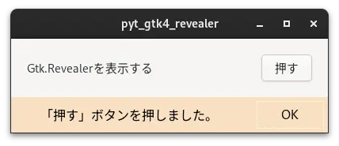

# pyt_gtk4_revealer

 

## 内容 

ボタンを押すと、Gtk.Revealerを表示するプログラムです。Gtk.Revealer部分の装飾はCSSファイルにより指定しています。  
uiの作成には、cambalacheを使用します。

- cssの指定は、Gtk.RevealerとGtk.Revealer上のGtk.Boxに対しておこないました。
- これらのWidgetにcssの設定を適応させるために、css-nameを設定しています。

 

## 履歴

2024/6/12　プログラム作成済 

## 参考にしたHP
